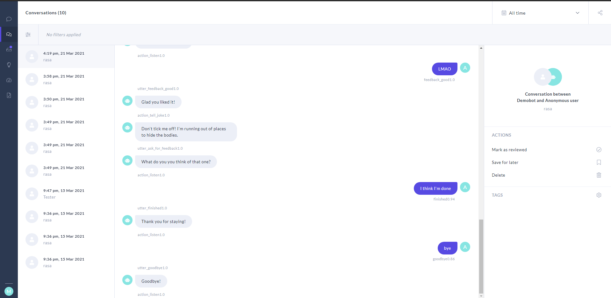
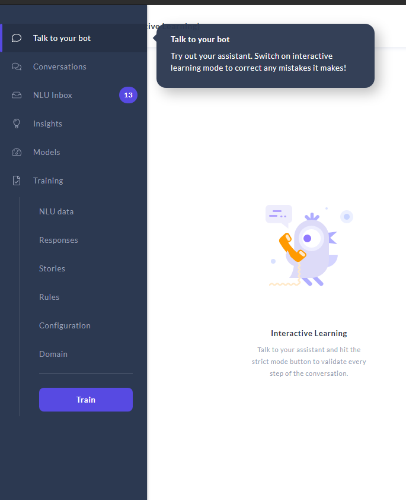
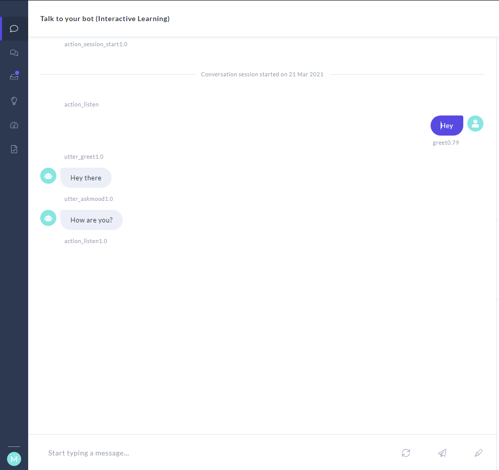

# JokeBot
An interactive bot made with Rasa that tells the user jokes. The bot is a friend trying to become a comedian and the user's role is to give feedback on their jokes. 

## How to Run
To run the bot, make sure you have `rasa x` installed on `Anaconda` or any python virtual environment. For detailed instructions on the installation of Rasa please refer to the official documentation: [How to Install Rasa X](https://rasa.com/docs/rasa-x/installation-and-setup/install/local-mode).

If you want to install Rasa X by itself, usually all you need to do to install rasa-x is run the following command:
```pip3 install rasa-x --extra-index-url https://pypi.rasa.com/simple```

If the above doesn't work, refer to the documentation linked above.


Once Rasa X has been installed, navigate to the root folder of the project, and do the following:
 - run `rasa x` and wait for it to launch. **Note:** This may take a while depending on your system.
 - _**VERY IMPORTANT**_ : In a **separate** terminal window/tab, run the command `rasa run actions`, to run a custom actions server for the bot to be able to work properly.
- If there is an error about `spaCy` model not being able to lead, run the following command, and it should work: `python -m spacy download en_core_web_md`

Once the commands finish running, they should open up a browser window that goes directly to Rasa X like so:



If you hover over the toolbar to the left, and click the option that says "Talk to you assistant", you can speak to the bot in a GUI.



On this screen, simply type a message like "hey", to get started!



Have fun talking to our bot!

## New Features for A3
 - ### Graphical User interface
 - ### Extra Topic
 - ### Out of Scope Message Handling
 - ### Synonym Recognition
 - ### Named Entity Recognition
 - ### Sentiment Analysis
