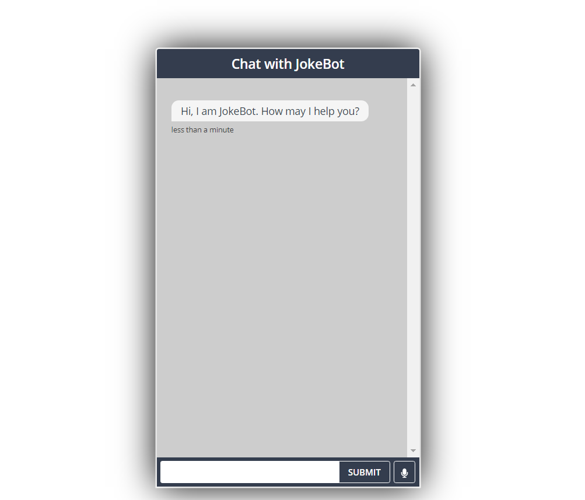
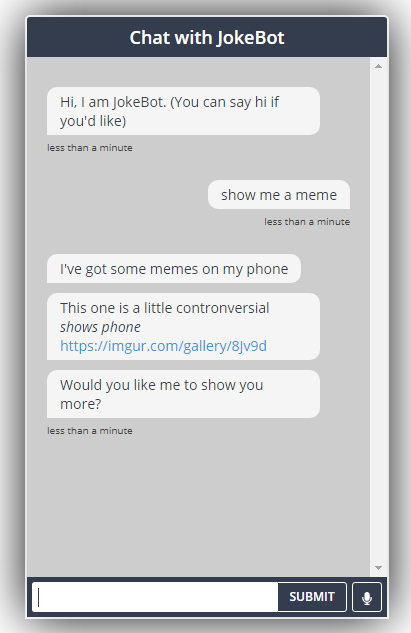
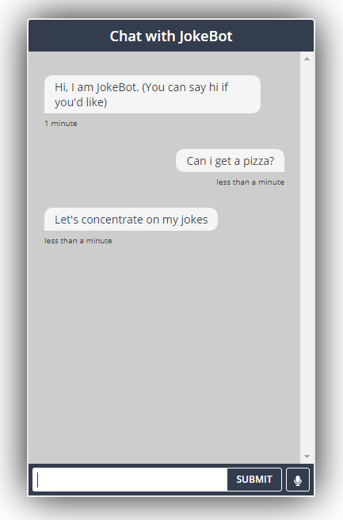
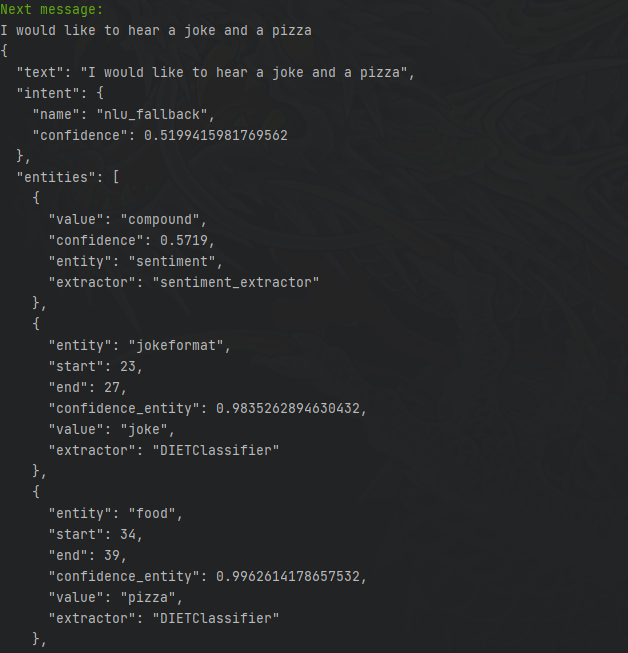
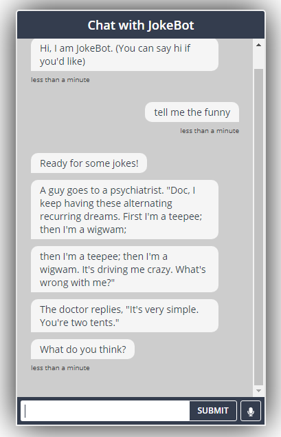
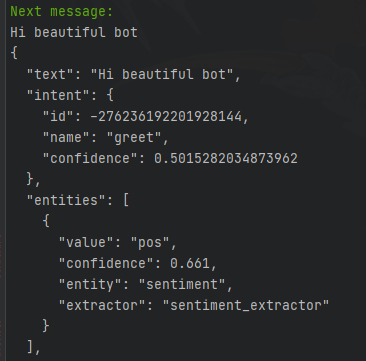
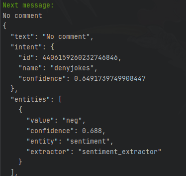
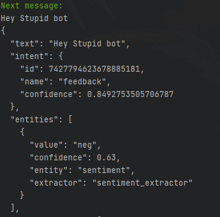

# JokeBot
An interactive bot made with Rasa that tells the user jokes. The bot is a friend trying to become a comedian and the user's role is to give feedback on their jokes. 

## Installation

To install, enter the following commands into a terminal one after another, after switching to/activating a virtual environment if needed:
- `pip3 install rasa`
- `pip3 install spacy`
- `pip3 install nltk`
- `spacy download en_core_web_md`
- `pip install vaderSentiment`
  
This should install all required dependencies. (Note: I tried my best to account for all the cases but I am sorry if your installation fails due to 
other unspecified errors)

### Other Troubleshooting
If you have issues with the installation, know that to run the bot you must have `rasa` installed on `Anaconda` or any python virtual environment.
For detailed instructions on the installation of Rasa please refer to the official documentation: [How to Install Rasa](https://rasa.com/docs/rasa/installation/).

## How to Run
**TO RUN THE BOT, YOU WILL NEED TO RUN 3 TERMINAL WINDOWS AS FOLLOWS:**

### Terminal Window 1 - Main Rasa Model
 Navigate to the root folder of the project, and enter the following into the console:

 `rasa run --m ./models --endpoints endpoints.yml --port 5002 -vv --enable-api --cors "*"` 
 
and wait for it to launch. **Note:** This may take a while depending on your system.

### Terminal Window 2 - Rasa Custom Actions Server 
Again in the root folder of the repository, enter the following into the console:

`rasa run actions`

The command above will run a custom actions server for the bot to be able to work properly.

### Terminal Window 3 - HTML Page for Bot GUI
Once the commands finish running, in another **separate** terminal, 
**navigate to the `GUIWebsite` folder** using something like `cd GUIWebsite` from the root folder.
Then type the following into the console to start up the GUI: 

`python -m http.server 8000`

Once that is done, type `localhost:8000` into your browser's URL field, and you should be greeted
with this page:

Have fun talking to our bot! :)

_**Aside**: The current GUI for the bot will use text-to-speech, so don't be alarmed when the bot speaks to you!_

## Issues
 Feel free to raise any issues you might encounter on the repository, and we'll be happy to help! :)

## New Features for A3
 - ### Graphical User interface
   For A3, we implemented a simple GUI for Rasa chatbots, that was adapted from [Scalable Minds' Chatroom Repository](https://github.com/scalableminds/chatroom).
   This GUI has the typical text input field through which the usercan speak to our bot, and it also has a speak-to-talk option, but only for Chrome.
   It also has a function to read out the messages the bot sends using text-to-speech.
   
   By adding these features to our GUI, we can now keep track of conversation history in a clean and readable format. The speak-to-talk, and text-to-speech add
another layer of accessibility to our bot, so the conversation can be enjoyed to its fullest extent. Here is another picture of the GUI in action:
   

 - ### Extra Topic
   We decided to include an extra topic for our joke bot in the form of memes. Since "memes" are another form of jokes that are part of a rapidly
   advancing movement that brings humour to the internet, we included them as an extra topic for our bot. When the user asks for memes, the bot will deliver by 
   showing them a link to a few galleries filled with some memes, which should entertain the user. 
   
   By adding this feature to our bot, we improve the breadth of knowledge it has and made sure that the conversation had ample opportunities to be interesting,
   rather than just being an infinite loop of jokes and responses. Here is a snippet of a conversation showing this feature in action:
   
   
 - ### Out of Scope Message Handling
   For A3, We also chose to add extra functionality to the out-of-scope messages in our bot. We previously implemented fallback, and default options,
   which are similar to out-of-scope messages. In our bot, if the user enters a message that is outside the scope of the two topics our bot can currently handle,
   i.e. jokes and memes, then the bot will respond appropriately. For example, if the user enters something like: "Can I order a pizza?" the bot classifies this as 
   out-of-scope, and responds with something like "Can we please focus on the jokes?"
   
   By adding this feature to our bot, we directly improve the flow of language to ensure that the bot doesn't break when the user enters something
   completely unexpected. Here is a snippet of a conversation showing this feature in action:
   
  
- ### Named Entity Recognition
   JokeBot can now identify entities in the user's messages! By adding this feature to our bot, we can enhance our bot's ability to respond to user messages
   by understanding what the user might want to ask the bot about. Since this feature is implicitly defined, we can't see it in the conversation directly, but here is a snippet of the shell
   that shows the entities extracted from a specific message:
    
  We can see from the screenshot that the bot successfully extracted the entities `pizza` and `joke` from the user message
 - ### Synonym Recognition
   Our bot now has the ability to recognize synonyms for extracted entities from user messages. We even used this to implement some recognitions for spelling mistakes!
   (although this isn't the intended use).

   By adding this feature to our bot, we directly improve the flow of language to ensure that the bot doesn't break when the user enters a synonym for 
   an entity that the bot would fail to pick up on if this feature wasn't implemented. Here is a snippet of a conversation showing this feature in action:
   
   
   Here the bot recognizes `the funny` as a synonym for `joke`, so it maps it to the correct entity and continues the conversation accordingly.
 - ### Sentiment Analysis
   JokeBot now uses NLTK's `sentiment` package to categorize user messages with sentiments like `pos, neg,` or `neu`. 

   By adding this feature to our bot, we used it to handle the feedback the user gives to the bot's jokes and display other messages
   accordingly. This was achieved by creating a custom component for Sentiment Analysis alongside a custom action. Since we also implicitly built sentiment analysis into our bot, 
   it cannot directly be seen in conversation, so here are a few snippets of the shell that shows the sentiment extracted from a few messages:
   - Positive Sentiment:
   
   - Neutral Sentiment:  
   
   - Negative Sentiment:  
   

Here the bot detects the correct sentiment from the user messages.
